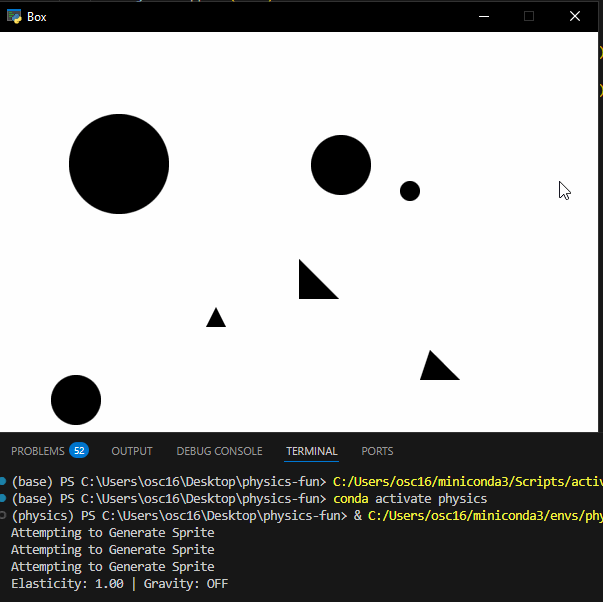

# physics-fun
A little project to build and visualize a physics engine. This project is mostly from 2023, when I was taking some course in basic numeric methods, and wanted to try to learn some skills that would be useful for gamedev.

# Todo
Phase 2 (Good Shapes in Box);
1. ~~Implement elasticity slider to decide force loss on collsion~~
2. ~~Implement External Forces, starting with gravity~~
3. Make one of the Shapes Controllable to provide 'player' interaction (For later)

Phase 3 (3d Spheres), (maybe);
[Create 3d spheres in box simulation using what I've Learned]

# Completed
Phase 0 (Balls in Box); COMPLETE
1. ~~Add proper comments to code already present~~
2. ~~Reevaluate the necessity of the CVector Vector handling~~ [Removed CVector usage]
3. ~~Change refresh() actions over to using the TimeFuncs.timestep() function, as well as being tied to the system clock instead of framerate~~
4. ~~Implement and test bsic ball on ball collision~~
5. ~~Allow free selection of Ball Size~~
6. ~~[Maybe] implement refresh() new collision rechecking to allow a Ball object to continue bouncing multiple times in one refresh~~, [Maybe] ~~implement collision based physics ticks rather than frame based ones, ie extrapolate object paths until first collision/(lazily possible collision using event horizon) and do a physics refresh exactly at that point to reduce tick frequency.~~ Second part Unfeasible at this stage
7. ~~Fix Basic Dynamic Sprite Generation for Barriers and Balls~~
8. ~~Fix physics bug (Likely in collision)~~        RESOLVED - Double counting of certain offsets was issue
9. ~~Work on gfx bugs~~
10. ~~Different weights~~

Phase 1 (Shapes in Box);
1. ~~Create a tri object~~

# Skills demonstrated or developed
+ Python Programming
+ Familairity with numpy / computer matrix math
+ State Space Modelling
+ Implicit/Explicit Discretization techniques (Though in the end setteled on Newton for simplicity)
+ Convex geometry and applications
+ Real time visualizastion powered by SDL2
